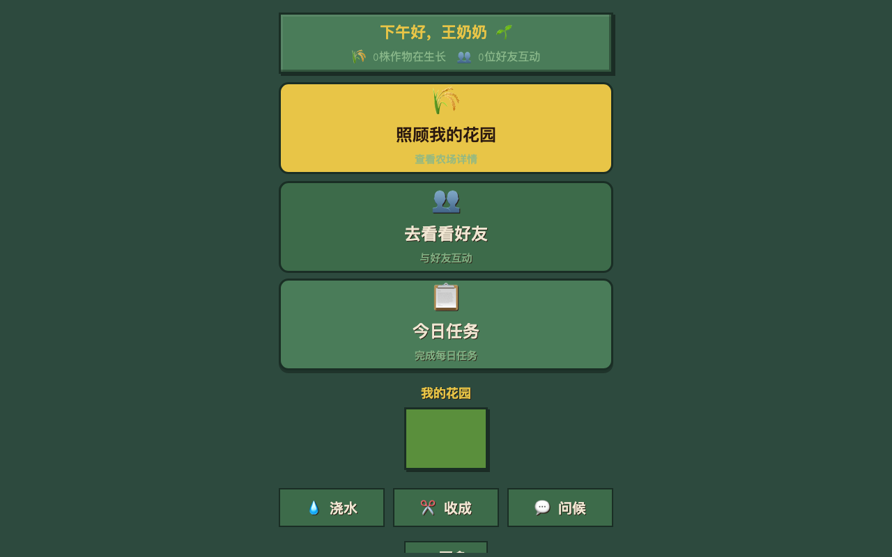
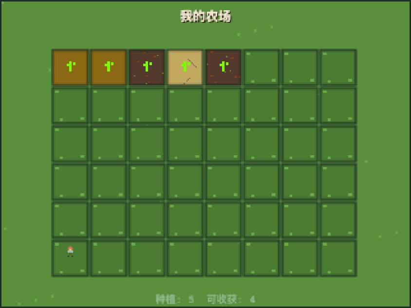
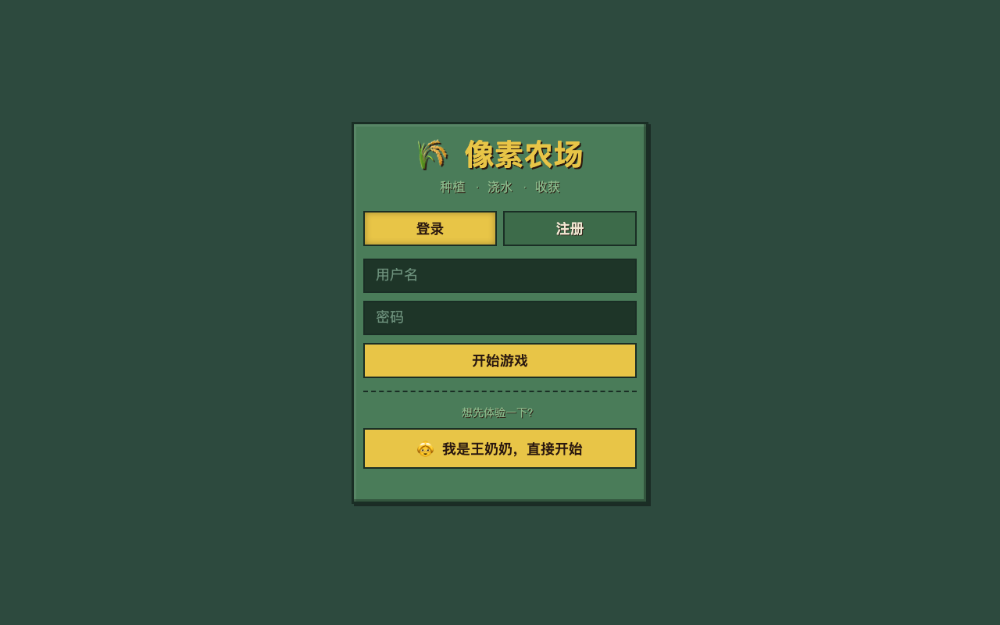
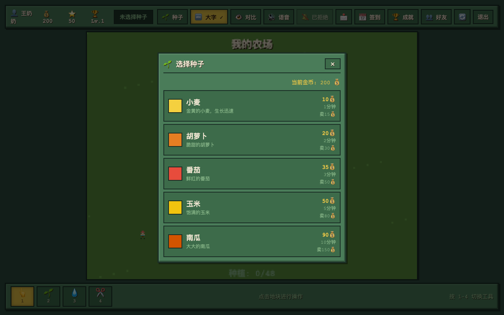
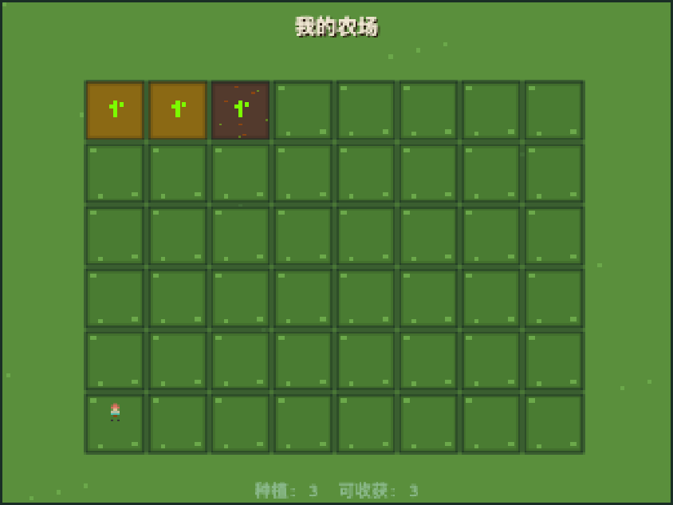
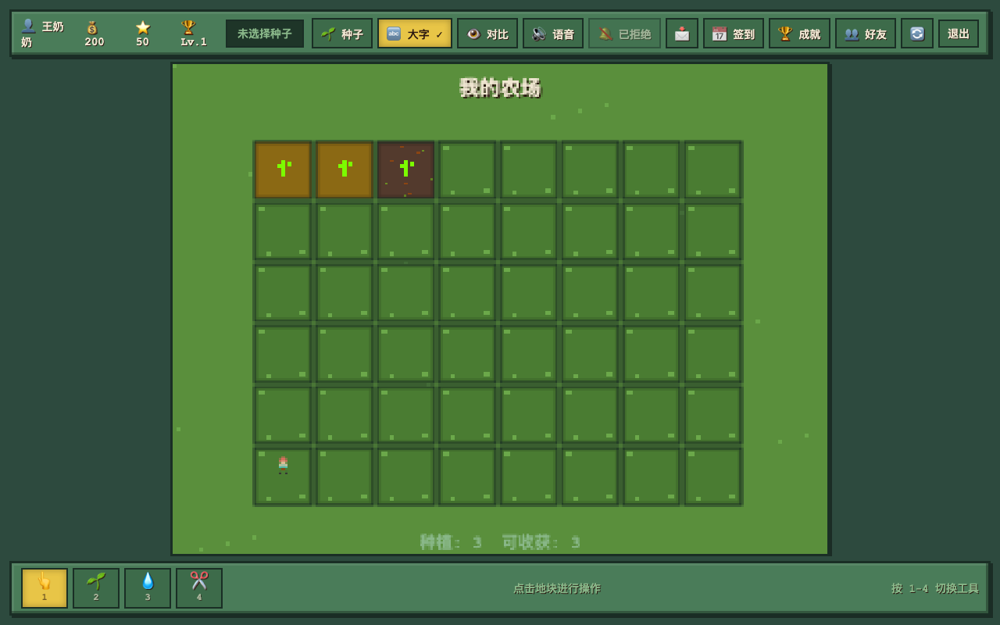
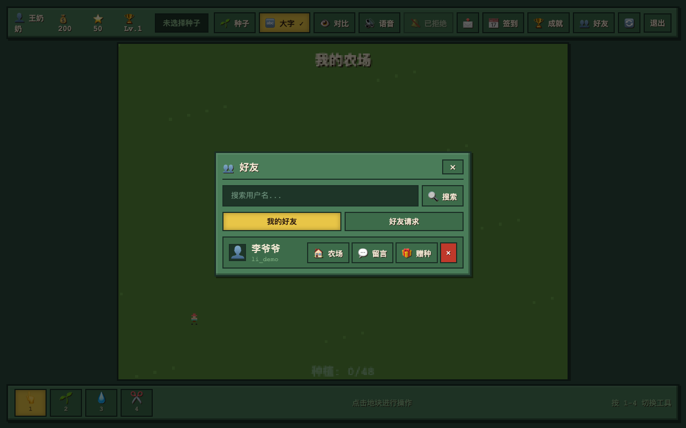

# 🌾 像素农场 —— 老年人社交种菜游戏

> **不用下载APP，在电脑/手机上打开网页就能玩！**
>
> 和好友一起种菜、浇水、收获，作物成熟还会发消息提醒你！

---

## 📸 游戏长什么样？

### 长者版首页 —— 三大入口，清清楚楚



专门为老年人设计的入口页面，**字大、按钮大、操作简单**：
- **🎮 开始游戏** —— 直接进农场种菜
- **👥 我的好友** —— 看看老伙伴们的农场
- **🔔 消息通知** —— 谁帮我浇水了、菜熟了，一目了然

### 农场主界面 —— 像素小人陪你种菜



**界面说明：**
- **顶部绿条** 👆 —— 显示你的名字、金币、经验值和等级
- **中间大块绿色区域** 🌱 —— 你的农场，一共48块地可以种菜
- **底部工具栏** 🛠️ —— 四个按钮：查看、种植、浇水、收获
- **像素小人** 🧑‍🌾 —— 点击地块后，小农场主会"跑"过去干活，热闹又亲切！
- **右下角提示** 💡 —— 告诉你当前该做什么

---

## 🚀 第一步：安装环境（只需一次）

### 你需要准备什么？

| 项目 | 要求 | 检查方法 |
|------|------|---------|
| 电脑 | Windows / Mac / Linux 都行 | — |
| 网络 | 能上网就行 | 打开百度试试 |

### 安装 Node.js（游戏的"发动机"）

Node.js 是让游戏跑起来的必备软件，**安装一次，以后再也不用装**。

#### Windows 电脑：

1. 打开浏览器，访问 👉 https://nodejs.org
2. 点击大大的绿色按钮 **"LTS"**（推荐大多数用户）
3. 下载完成后，双击安装包，一直点 **"下一步"** 即可
4. 装好后，按键盘 `Win + R`，输入 `cmd`，回车
5. 在黑色窗口里输入：
   ```
   node --version
   ```
6. 如果看到 `v20.x.x` 或更高的数字，说明装好了！✅

#### Mac 电脑：

1. 打开浏览器，访问 👉 https://nodejs.org
2. 点击大大的绿色按钮 **"LTS"**
3. 下载 `.pkg` 文件，双击安装，一直点 **"继续"**
4. 打开 **"终端"**（按 `Command + 空格`，输入 `terminal`）
5. 输入：
   ```bash
   node --version
   ```
6. 看到 `v20.x.x` 就成功了！✅

> **遇到困难？** 请找身边年轻人帮忙安装 Node.js，这是唯一需要技术的地方，装好后老年人完全可以自己玩！

---

## 🎮 第二步：启动游戏

### 1. 下载游戏代码

**方式A：让年轻人帮你下载**
- 把这篇文章发给年轻人，让他们把代码下载到电脑上

**方式B：自己下载（会用电脑就行）**
- 联系开发者获取游戏文件夹，解压到桌面

假设游戏文件夹放在了桌面上，名字叫 `pixel-farm-game`。

### 2. 打开黑窗口，进入游戏文件夹

#### Windows：
1. 按 `Win + R`，输入 `cmd`，回车
2. 输入下面这行（把用户名换成你的）：
   ```
   cd Desktop\pixel-farm-game
   ```

#### Mac：
1. 打开 **"终端"**
2. 输入：
   ```bash
   cd Desktop/pixel-farm-game
   ```

### 3. 安装游戏依赖（第一次需要）

在黑窗口里输入：
```bash
npm install
```

等待一会儿，看到满屏文字滚动，最后出现 `added xxx packages` 就是装好了。

> ⏱️ 这一步需要等 1-3 分钟，取决于网速。期间不要关掉窗口！

### 4. 启动游戏！

在黑窗口里输入：
```bash
npm start
```

看到下面这样的字，就说明游戏启动成功了：

```
🎮 像素农场游戏服务器已启动
📍 HTTP 服务: http://localhost:3000
🔌 WebSocket: ws://localhost:3000
```

### 5. 用浏览器打开游戏

**打开你常用的浏览器**（Chrome、Safari、Edge 都可以），在地址栏输入：

```
http://localhost:3000
```

然后按回车，游戏界面就出现了！🎉

> 💡 **小提示：** 可以把上面的地址收藏到浏览器书签，下次直接点书签就能玩！

---

## 👴 第三步：注册账号，开始种菜

### 想先体验？用 Demo 账号一键登录！

游戏准备了两个体验账号，不用注册，直接就能玩：

| 账号 | 用户名 | 密码 | 身份 |
|------|--------|------|------|
| 王奶奶 | `wang_demo` | `demo123` | 已有好友和作物的农场主 |
| 李爷爷 | `li_demo` | `demo123` | 王奶奶的好友 |

> 🎯 **推荐玩法**：用王奶奶登录，添加李爷爷为好友，互相浇水、留言，完整体验社交种菜！

### 第一次玩？先注册

1. 打开游戏页面后，看到登录框：

   

2. 点击 **"注册"** 按钮
3. 输入：
   - **用户名**：起个好记的名字，比如 `张爷爷`、`李奶奶`
   - **密码**：至少4位数字，比如 `1234`、`6666`
   - **显示名称**（可选）：可以写真实名字，好友能看到
4. 点击 **"创建农场"**
5. 成功！自动进入游戏画面！

### 下次怎么登录？

1. 打开 `http://localhost:3000`
2. 输入用户名和密码
3. 点 **"开始游戏"**
4. 直接进农场，之前的菜都还在！

---

## 🌱 第四步：怎么玩？—— 老年人专属操作指南

### 🎯 核心玩法：种菜 → 浇水 → 收获 → 卖钱

#### 第一步：选种子

1. 点击顶部 **"🌱 种子"** 按钮
2. 弹出种子商店：

   

3. 看到每种作物的：
   - **名字**：小麦、胡萝卜、番茄、玉米、南瓜
   - **种子价格**：买种子要花多少金币
   - **生长时间**：多久能熟
   - **卖出价格**：收获了能卖多少钱
4. 点击你想种的作物，弹窗关闭，底部提示会变成"选择种子后点击空地块种植"

> 💰 **新手建议**：先种 **小麦**（10金币，1分钟成熟，卖15金币）

#### 第二步：种植

1. 点击底部工具栏的 **"🌱 种植"** 按钮（或者按键盘 `2`）
2. 鼠标移到农场上，点击一块**空地**（绿色的格子）
3. 看到地里长出了小苗，金币减少了，就是种好了！

   

#### 第三步：浇水加速 ⏩

1. 点击底部 **"💧 浇水"** 按钮（或者按键盘 `3`）
2. 点击已经种了作物的地块
3. 地块下面出现蓝色水条，作物长得更快了！

> 💧 **浇水效果**：生长速度提升 **50%**！持续1小时。

#### 第四步：收获 💰

1. 等地里的作物**成熟**——你会看到：
   - 作物变得**更大更鲜艳**
   - 地块右上角出现**黄色小方块** ✅
   - 成熟作物还会**一闪一闪**地发光 ✨

   

2. 点击底部 **"✂️ 收获"** 按钮（或者按键盘 `4`）
3. 点击成熟的地块
4. **金币增加！经验增加！** 地块变回空地，可以重新种！

> 🔔 **贴心功能**：就算你把浏览器关了、电脑关了，作物也会继续生长。成熟后下次打开游戏，右上角会弹出通知提醒你！

---

## ✨ 新功能介绍 —— 游戏越来越好玩了！

### 🧑‍🌾 像素小人

现在农场里有个**小农场主**陪着你！点击地块要种菜、浇水、收获时，小人会"哒哒哒"跑过去干活，就像真的在田里忙碌一样，热闹极了！

### 🌤️ 天气系统

农场里有时会**出太阳** ☀️，有时会**下雨** 🌧️。下雨天土地会自动湿润，不用你亲自浇水，真是老天爷帮忙！

### 🟫 土壤状态

每块地的土壤都有**干湿度**：
- **太干了** → 土地出现小裂纹，像旱了的田
- **湿润了** → 土地会微微发光，像刚浇过水
- **恰到好处** → 作物长得又快又壮

### ❤️ 作物健康度

作物也有"心情"呢！照顾得越好（及时浇水、土壤湿润），收获时卖的金币就越多。偷懒不浇水，作物会"蔫蔫的"，卖价就打折扣啦！

---

## 📱 手机/平板能玩吗？

**能！** 只要手机和电脑连同一个WiFi：

1. 先在电脑上按上面的步骤启动游戏
2. 查看电脑的IP地址：
   - **Windows**：黑窗口里输入 `ipconfig`，找 `IPv4 地址`
   - **Mac**：终端里输入 `ifconfig | grep inet`，找 `192.168.x.x`
3. 手机浏览器输入：`http://192.168.x.x:3000`

> 📲 **更简单的方法**：让年轻人帮你扫个二维码，直接打开手机版！

---

## 👥 第五步：加好友，一起种菜（社交功能）

### 为什么要有好友？

- 看看好友的农场种了什么
- 帮好友浇水，增进感情
- 在好友农场里留言，打个招呼
- 互相赠送种子，互通有无
- 作物成熟时发消息提醒

### 怎么加好友？

1. 点击顶部 **"👥 好友"** 按钮
2. 在搜索框里输入好友的用户名，比如 `li_demo`
3. 点击 **"添加好友"**
4. 对方同意后，就能在好友列表里看到他了！



### 好友能做什么？

| 功能 | 说明 | 限制 |
|------|------|------|
| **查看农场** | 点好友名字，去他农场参观 | 随时都可以 |
| **帮浇水** | 好友的地干了，帮他浇一浇 | 每天最多3次 |
| **农场留言** | 在好友农场留句话，比如"你的番茄真大！" | 随时都可以 |
| **赠送种子** | 把自己多余的种子送给好友 | 随时都可以 |

> 🔔 **通知功能**：点击顶部的 **"🔔"** 铃铛按钮，可以看到：
> - 作物成熟提醒
> - 好友请求
> - 好友帮你浇水的消息
> - 系统消息

---

## 🔔 后台通知——人不在也能收到提醒

这是游戏最贴心的功能之一！

### 作物成熟怎么通知你？

| 通知方式 | 说明 | 是否需要额外设置 |
|---------|------|----------------|
| **游戏内弹窗** | 打开游戏时自动弹出 | 不需要 |
| **浏览器通知** | 电脑右上角弹出小窗口 | 第一次需要点"允许" |
| **手机短信** | 发短信到手机 | 需要绑定手机号（开发中） |
| **微信消息** | 微信收到提醒 | 需要关注公众号（开发中） |

### 怎么开启浏览器通知？

1. 第一次打开游戏时，浏览器会问："是否允许发送通知？"
2. 点击 **"允许"**
3. 以后就算游戏页面最小化，作物成熟了也会弹出提醒！

---

## ❓ 常见问题（FAQ）

### Q1：黑窗口里的文字一直滚，停不下来？

**A：** 这是正常的！不要关这个窗口，游戏就是靠它运行的。最小化放一边就行。

### Q2：关了浏览器，我的菜还在吗？

**A：** 在！作物按**真实时间**生长，关电脑、关浏览器都不影响。下次打开，菜可能已经熟了！

### Q3：金币花完了怎么办？

**A：** 小麦种子只要10金币，成熟后卖15金币，**稳赚不赔**！只要循环种小麦，金币会越来越多。

### Q4：换了电脑，之前的农场还在吗？

**A：** 游戏数据存在你启动游戏的那台电脑上。换电脑需要重新注册。建议固定一台电脑玩。

### Q5：提示"登录已过期"怎么办？

**A：** 点击**"退出"**按钮，重新输入用户名密码登录即可。

### Q6：游戏画面太小/太大？

**A：** 按键盘 `Ctrl` + 鼠标滚轮（或 `Ctrl` + `+`/`-`）可以缩放网页。

### Q7：按了按钮没反应？

**A：**
1. 检查一下是不是点了**"查看"**工具（👆）——这个工具只显示信息，不会种地
2. 先点击**"种植"**（🌱）或**"浇水"**（💧）按钮，再点地块

---

## 🛠️ 遇到问题找谁？

| 问题类型 | 解决方法 |
|---------|---------|
| 装不上 Node.js | 找家里年轻人，5分钟搞定 |
| 打不开网页 | 检查黑窗口是否还在运行 |
| 忘记密码 | 重新注册一个新账号 |
| 游戏有 bug | 截图 + 描述，联系开发者 |

---

## 📂 项目文件说明（给想了解的人）

```
pixel-farm-game/
├── client/              # 游戏画面（网页）
│   ├── index.html       # 主页面
│   ├── css/
│   │   └── style.css    # 颜色和布局
│   └── js/              # 游戏逻辑
│       ├── game.js      # 种地、浇水、收获
│       ├── ui.js        # 按钮、弹窗
│       ├── renderer.js  # 画面绘制
│       ├── network.js   # 网络通信
│       ├── avatar.js    # 像素小人动画
│       ├── cropSprites.js   # 作物像素画
│       ├── particles.js     # 特效粒子
│       ├── weatherEffects.js # 天气效果
│       ├── soilRenderer.js   # 土壤状态绘制
│       └── weather.js        # 天气逻辑
├── server/              # 游戏服务器
│   ├── index.js         # 启动入口
│   ├── routes/          # 各种功能接口
│   ├── services/        # 种菜、好友、通知逻辑
│   └── jobs/            # 定时检查作物生长
├── database/            # 游戏存档
│   └── farm_game.db     # SQLite 数据库（所有玩家数据）
├── docs/                # 说明书
│   ├── screenshots/     # 游戏截图
│   └── *.md             # 详细文档
└── package.json         # 依赖清单
```

---

## 📝 开发者信息

- **游戏类型**：像素风格种菜社交游戏
- **技术栈**：HTML5 Canvas + Node.js + WebSocket + SQLite
- **数据库**：SQLite（`database/farm_game.db`）
- **适用人群**：老年人、休闲玩家、社交爱好者

---

## 🙏 致谢

灵感来源：[星露谷物语 (Stardew Valley)](https://www.stardewvalley.net/)

**祝各位爷爷奶奶种菜愉快，收获满满！** 🌾💰
