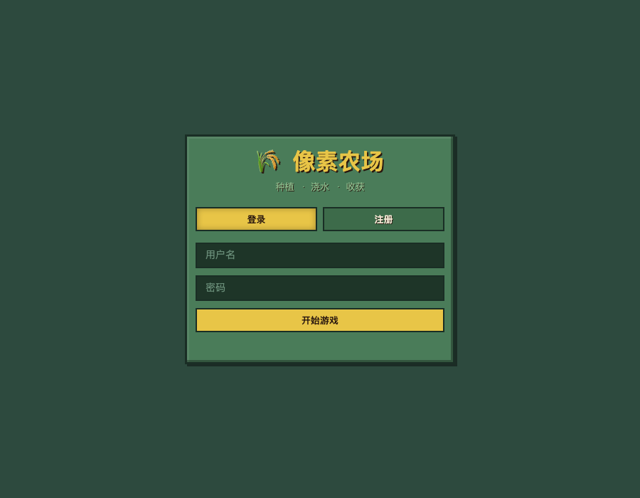
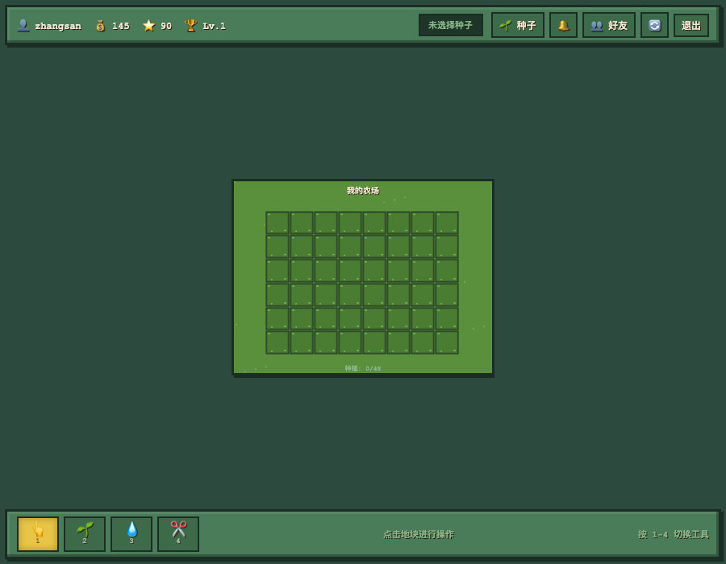
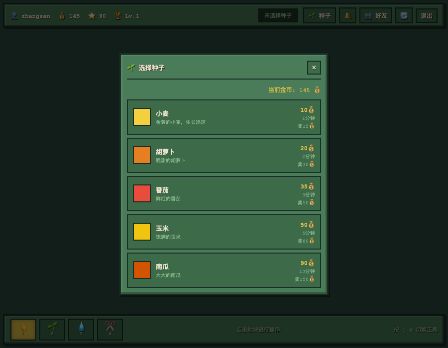
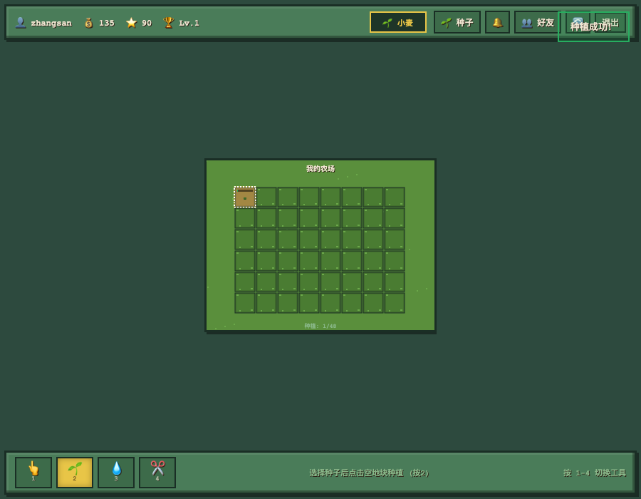
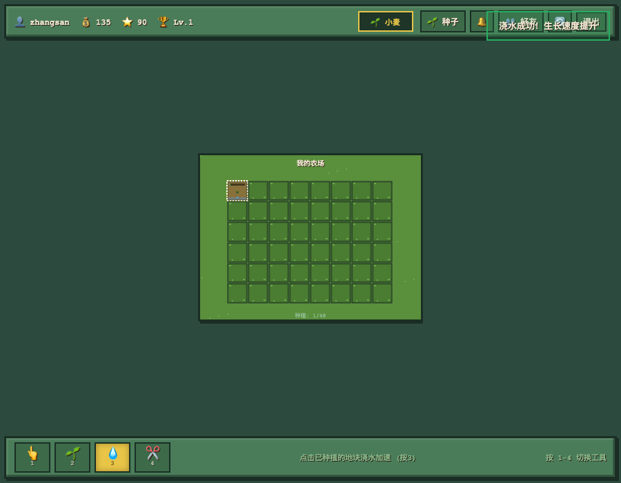
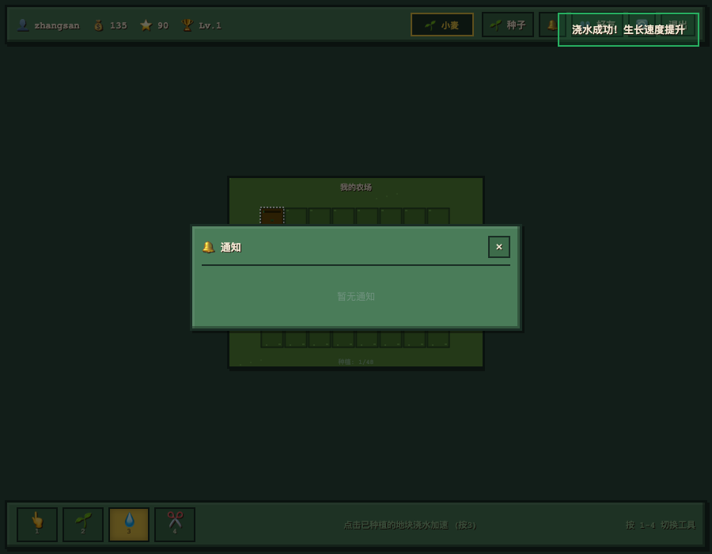
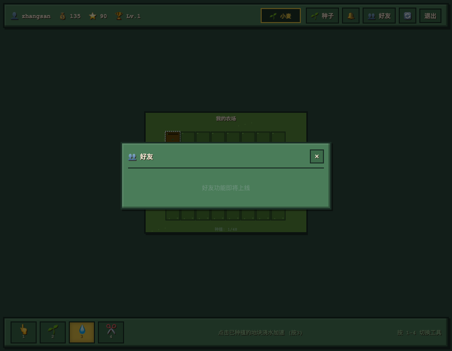

# 🌾 像素农场 — 开发路线图

> 面向老年人的社交种菜游戏，让每位爷爷奶奶都能享受种植的乐趣！

---

## 📸 当前游戏界面

### 1. 登录界面
简洁的像素风格登录页，支持登录/注册切换。



### 2. 游戏主界面
登录后进入农场，顶部显示玩家信息（用户名、金币、经验、等级），中间是 8×6 的农场网格，底部是工具栏（查看/种植/浇水/收获）。



### 3. 种子商店
点击「种子」按钮弹出种子选择弹窗，目前有 5 种作物可选：

| 作物 | 种子价格 | 生长时间 | 收获售价 |
|------|---------|---------|---------|
| 🌾 小麦 | 10 金币 | 1 分钟 | 15 金币 |
| 🥕 胡萝卜 | 20 金币 | 2 分钟 | 30 金币 |
| 🍅 番茄 | 35 金币 | 3 分钟 | 50 金币 |
| 🌽 玉米 | 50 金币 | 5 分钟 | 80 金币 |
| 🎃 南瓜 | 90 金币 | 10 分钟 | 150 金币 |



### 4. 种植操作
选择种子后点击空地块即可种植，扣除相应金币，地块显示种子状态。



### 5. 浇水加速
切换到「浇水」工具，点击已种植的地块，浇水后作物生长速度提升 **1.5 倍**！



### 6. 通知中心
点击顶部「🔔 通知」按钮查看系统通知，作物成熟时会收到提醒。



### 7. 好友系统
完整的社交功能，支持添加好友、查看好友农场、帮好友浇水和留言。



---

## 🗺️ 开发路线图

### 🔴 Phase 1：社交核心（优先级：⭐⭐⭐⭐⭐）

> **目标**：让老年人可以和亲友互动，解决「孤独感」问题

| # | 功能 | 说明 | 复杂度 | 预计工时 |
|---|------|------|--------|---------|
| 1.1 | **好友系统完整版** | 搜索用户、发送/接受/拒绝好友请求、删除好友 | 中 | 3 天 |
| 1.2 | **访问好友农场** | 点击好友头像进入TA的农场，只能查看不能操作 | 中 | 2 天 |
| 1.3 | **帮好友浇水** | 访问好友农场时，每天可帮浇 3 次水，双方获得奖励 | 低 | 1 天 |
| 1.4 | **农场留言板** | 在好友农场留言，类似 QQ 空间的"踩一踩" | 中 | 2 天 |
| 1.5 | **赠送种子** | 好友间互赠种子，促进社交互动 | 中 | 2 天 |

**本阶段验收标准**：
- [ ] 能搜索并添加好友
- [ ] 能查看好友农场
- [ ] 能帮好友浇水（每日限制 3 次）
- [ ] 能互赠种子

---

### 🟠 Phase 2：通知升级（优先级：⭐⭐⭐⭐⭐）

> **目标**：老年人容易忘记收菜，多种渠道提醒确保不错过

| # | 功能 | 说明 | 复杂度 | 预计工时 |
|---|------|------|--------|---------|
| 2.1 | **浏览器推送通知** | 使用 Push API，网页最小化/后台也能收到成熟提醒 | 中 | 2 天 |
| 2.2 | **通知偏好设置** | 让用户选择接收哪些通知、通过什么渠道 | 低 | 1 天 |
| 2.3 | **短信通知** | 集成阿里云/腾讯云短信，绑定手机号后发短信提醒 | 高 | 3 天 |
| 2.4 | **微信通知** | 微信公众号模板消息，扫码绑定后微信提醒 | 高 | 4 天 |

**本阶段验收标准**：
- [ ] 作物成熟时浏览器推送通知
- [ ] 可设置通知偏好
- [ ] 可选短信/微信提醒（高级功能）

---

### 🟡 Phase 3：游戏深度（优先级：⭐⭐⭐⭐）

> **目标**：增加游戏可玩性和长期留存

| # | 功能 | 说明 | 复杂度 | 预计工时 |
|---|------|------|--------|---------|
| 3.1 | **每日签到** | 登录送金币/种子，连续签到奖励递增 | 低 | 1 天 |
| 3.2 | **作物枯萎机制** | 成熟后 24 小时不收获会枯萎，增加紧迫感 | 低 | 1 天 |
| 3.3 | **天气系统** | 晴天/雨天/干旱，影响生长速度和浇水需求 | 中 | 3 天 |
| 3.4 | **任务/成就系统** | "收获 100 个小麦"、"连续登录 7 天"等成就 | 中 | 3 天 |
| 3.5 | **排行榜** | 本周最富有农场主、种植能手等 | 中 | 2 天 |
| 3.6 | **农场装饰** | 用金币买栅栏、小路、花坛美化农场 | 中 | 3 天 |

**本阶段验收标准**：
- [ ] 每日签到有奖励
- [ ] 天气影响作物生长
- [ ] 成就系统有成就感
- [ ] 排行榜激发竞争

---

### 🟢 Phase 4：老年人专属（优先级：⭐⭐⭐⭐⭐）

> **目标**：针对老年人用户群体的特殊需求优化

| # | 功能 | 说明 | 复杂度 | 预计工时 |
|---|------|------|--------|---------|
| 4.1 | **大字体模式** | 一键切换超大字体（18px → 24px），所有界面适配 | 低 | 2 天 |
| 4.2 | **高对比度模式** | 色弱/视力不佳用户专用配色方案 | 低 | 1 天 |
| 4.3 | **语音播报** | 作物成熟时播放语音："您的小麦熟啦！" | 中 | 2 天 |
| 4.4 | **一键求助** | 点击按钮生成二维码，子女扫码远程帮忙操作 | 中 | 3 天 |
| 4.5 | **操作录像回放** | 记录每一步操作，方便子女查看哪里错了 | 中 | 3 天 |

**本阶段验收标准**：
- [ ] 大字体模式下所有文字清晰可见
- [ ] 语音播报清晰可听
- [ ] 一键求助能生成有效二维码
- [ ] 操作记录可回放

---

### 🔵 Phase 5：技术升级（优先级：⭐⭐⭐）

> **目标**：提升系统稳定性和可维护性

| # | 功能 | 说明 | 复杂度 | 预计工时 |
|---|------|------|--------|---------|
| 5.1 | **迁移到 SQLite** | 内存数据库 → SQLite，数据持久化不丢失 | 中 | 2 天 |
| 5.2 | **数据备份导出** | 导出农场数据为 JSON，换电脑可导入 | 低 | 1 天 |
| 5.3 | **Docker 部署** | 一键部署到云服务器，老人不用装 Node.js | 中 | 2 天 |
| 5.4 | **多语言支持** | 简体中文 / 繁体中文 / 英文切换 | 低 | 2 天 |
| 5.5 | **离线模式** | 断网时本地记录操作，联网后同步 | 高 | 5 天 |

**本阶段验收标准**：
- [ ] 重启后数据不丢失
- [ ] Docker 一键部署
- [ ] 支持多语言切换

---

## 📅 推荐开发顺序

基于**老年人核心需求**和**开发依赖关系**，推荐按以下顺序开发：

```
第 1-2 周：Phase 1（社交核心）+ Phase 4（大字体/语音）
  ├─ 好友系统完整版 ← 最优先，解决孤独感
  ├─ 访问好友农场
  ├─ 帮好友浇水
  ├─ 大字体模式 ← 老年人刚需
  └─ 语音播报 ← 老年人刚需

第 3 周：Phase 2（通知升级）
  ├─ 浏览器推送通知
  └─ 通知偏好设置

第 4-5 周：Phase 3（游戏深度）
  ├─ 每日签到
  ├─ 任务/成就系统
  └─ 排行榜

第 6 周+：Phase 5（技术升级）
  └─ SQLite 迁移 + Docker 部署

未来迭代：Phase 6（真实感生态模拟）
  └─ 像素小人系统 + 独立作物图案 + 天气系统
```

---

## 🎯 MVP 定义（最小可行产品）

如果资源有限，最少需要完成以下功能即可上线给老年人使用：

1. ✅ 用户注册/登录
2. ✅ 种植/浇水/收获
3. ✅ 作物生长系统
4. ✅ 好友系统（添加好友 + 查看农场）
5. ✅ 浏览器推送通知
6. ✅ 大字体模式
7. ✅ 每日签到

**Hackathon 改造（已完成功能）**：

8. ✅ Demo 数据一键体验
9. ✅ 长者版首页（3大入口）
10. ✅ 预设留言（6条暖心问候）
11. ✅ 一键社交循环

---

### 🟣 Phase 6：真实感生态模拟（未来迭代）

> **目标**：让每次点击都有「有人在做这件事」的仪式感
>
> 灵感来源：《潜水员戴夫》——老人点击田地，像素小人自动跑过去展示动作

| # | 功能 | 说明 | 复杂度 | 预计工时 |
|---|------|------|--------|---------|
| 6.1 | **像素小人系统** | 点击田地后小人自动跑过去执行动作（种植/浇水/收获/除虫/施肥） | 高 | 2-3 天 |
| 6.2 | **独立作物图案** | 5种作物各有独特外观和生长动画（小麦麦穗、胡萝卜根系、番茄变色等） | 中 | 1-2 天 |
| 6.3 | **土壤湿度/肥力** | 地块有土壤状态（干燥/湿润/肥沃/贫瘠），影响作物生长 | 中 | 1 天 |
| 6.4 | **肥料系统** | 营养液/防虫剂/有机肥3种，各有专属小人动画 | 中 | 1-2 天 |
| 6.5 | **虫害系统** | 作物可能生虫，小人可跑过去除虫 | 低 | 0.5-1 天 |
| 6.6 | **天气系统** | 晴天/雨天/干旱，雨天小人自动撑伞 | 中 | 1 天 |
| 6.7 | **作物健康度** | 综合水分/肥料/虫害评估，影响产量 | 低 | 0.5 天 |

**预估总工时：3-4 天**

**为什么适合老年人**：
1. 可视化反馈：点击后看到小人跑过去，有「我做了一件事」的确认感
2. 降低焦虑：操作有延迟但可预期，不会觉得「是不是坏了」
3. 情感连接：小人就像虚拟伴侣，让游戏更有温度
4. 减少误触：动作执行期间锁定操作，防止老人重复点击

---

*路线图版本：v1.1 | 最后更新：2026-05-22*
